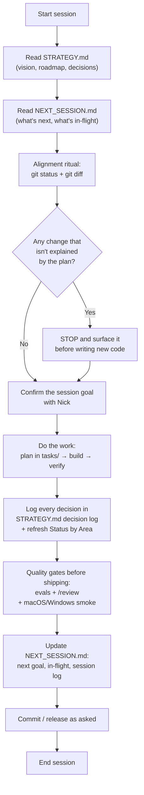

# How We Work — Landa Planning & Session Workflow

A short guide to the system we set up so a one-person company stays aligned across many work sessions and never loses a decision or a half-finished change.

---

## The idea in one line

Two living documents hold all the context, and a fixed start/end ritual makes sure every session reads them, reconciles reality against them, and writes back what changed.

---

## The documents

| File | What it's for | Who edits it |
|---|---|---|
| **`STRATEGY.md`** | The single source of truth: vision, positioning, roadmap, a dated **decision log**, status by area, open questions, and key facts/vendors. If anything conflicts, this wins. | Updated every session a decision is made |
| **`NEXT_SESSION.md`** | The tactical planner: what to do next, an "in-flight / don't forget" list, and a session log. | Updated at the end of every session |
| **`tasks/*.md`** | The detailed design/implementation plan for one feature (e.g. `adaptive-per-app-style.md`). | Written before building that feature |
| **`CLAUDE.md`** | Bakes this whole workflow into Claude's instructions so it's followed automatically. | Rarely |
| **Notion mirror** | A read-only copy of `STRATEGY.md` for viewing/sharing. Never the source of truth. | Re-synced on request only |

---

## How a single session flows

---

## The three rules that keep it aligned

1. **Log decisions the moment they happen.** Every decision gets a dated row in `STRATEGY.md`. Undocumented decisions are how changes get forgotten.

2. **Run the alignment ritual at the start.** Before writing any new code, check `git status` / `git diff` and match every uncommitted change to the plan. If something is there that nobody remembers doing, stop and surface it — this is the rule that stops "forgotten changes" from turning into bugs.

3. **"Working" is not "done."** A feature ships only after it clears its quality gates: an eval on real examples, plus security / maintainability / reliability review (`/review`), plus a check on both macOS and Windows.

Plus a **weekly review** (10 minutes): walk each area — what moved, what's blocked, what's next — and fix the docs if reality has drifted.

---

## Why it's built this way

A one-person company has no teammate to remember context or catch a forgotten edit. These docs and the ritual play that role: the next session (even weeks later, or a fresh AI session with no memory) can open `STRATEGY.md` + `NEXT_SESSION.md`, run one `git` check, and be fully caught up in five minutes.
